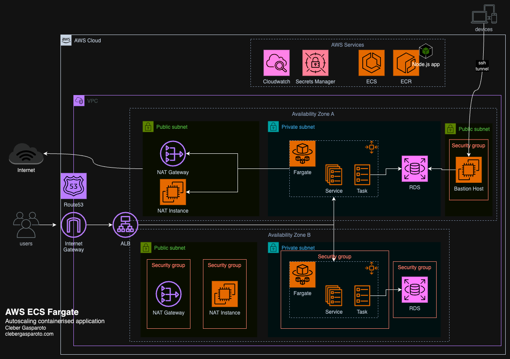

# AWS ECS Fargate com Terraform

# Configuração pasta: services/api

Criação de um projeto empty: npm init -y
Criar pasta src/index.ts e inserir no package.json o script de start e build
Configurar tsconfig em e selecionar a versão do seu nodejs: https://github.com/tsconfig/bases/tree/main/bases

Precisar ter o docker e postgres instalado.
Precisa instalar o grafana k6 para testar a api:
 - https://grafana.com/docs/k6/latest/set-up/install-k6/
 - https://grafana.com/docs/k6/latest/testing-guides/api-load-testing/

 Para rodar o k6 test:
 - Abrir o terminar powerShell no windows e navegar até a pasta services/api
 - Rodar: k6 run tests/load.js para rodar o script de teste da api
 - npm run build
 - node dist/index.js
 - Rodar: k6 run --out cloud tests/load.js : Envia as métricas de 
  testes para o site do grafana (Antes é preciso criar uma conta no site grafana cloud e gerar um token): https://grafana.com/docs/grafana-cloud/testing/k6/get-started/run-cloud-tests-from-the-cli/
  - Após gerar o token rodar no diretório /api: k6 cloud login --token YOUR_TOKEN

- Saída do teste:
       /\      |‾‾| /‾‾/   /‾‾/
     /\  /  \     |  |/  /   /  /
    /  \/    \    |     (   /   ‾‾\
   /          \   |  |\  \ |  (‾)  |
  / __________ \  |__| \__\ \_____/ .io

  execution: local
        script: tests/load.js
        output: -

     scenarios: (100.00%) 1 scenario, 2 max VUs, 40s max duration (incl. graceful stop):
              * default: 2 looping VUs for 10s (gracefulStop: 30s)

     ✓ Post status is 201

     checks.........................: 100.00% ✓ 20       ✗ 0
     data_received..................: 25 kB   2.5 kB/s
     data_sent......................: 5.2 kB  508 B/s
     http_req_blocked...............: avg=112.51µs min=0s     med=0s     max=1.12ms  p(90)=112.51µs p(95)=1.12ms
     http_req_connecting............: avg=25.58µs  min=0s     med=0s     max=511.6µs p(90)=0s       p(95)=25.58µs
   ✓ http_req_duration..............: avg=10.96ms  min=1.55ms med=4.68ms max=67.61ms p(90)=13.25ms  p(95)=65.3ms
       { expected_response:true }...: avg=10.96ms  min=1.55ms med=4.68ms max=67.61ms p(90)=13.25ms  p(95)=65.3ms
   ✓ http_req_failed................: 0.00%   ✓ 0        ✗ 20
     http_req_receiving.............: avg=235.67µs min=0s     med=0s     max=996.1µs p(90)=893.95µs p(95)=957.62µs
     http_req_sending...............: avg=31.18µs  min=0s     med=0s     max=567.6µs p(90)=5.6µs    p(95)=81.58µs
     http_req_tls_handshaking.......: avg=0s       min=0s     med=0s     max=0s      p(90)=0s       p(95)=0s
     http_req_waiting...............: avg=10.69ms  min=1.55ms med=4.56ms max=67.13ms p(90)=12.64ms  p(95)=63.83ms
     http_reqs......................: 20      1.960978/s
     iteration_duration.............: avg=1.01s    min=1s     med=1.01s  max=1.07s   p(90)=1.02s    p(95)=1.07s
     iterations.....................: 20      1.960978/s
     vus............................: 2       min=2      max=2
     vus_max........................: 2       min=2      max=2

Instalação de dependências:
 - drizzle-orm
 - express
 - pg (postgres)
 - npm install --save rimraf (inserir no script de buil para remover a pasta dist antes de buildar)
 - npm install --save-dev pino pino-http (biblioteca de logger)

Dependências para desenvolvimento:
 - [npm install --save-dev typescript @types/express @types/node @types/pg drizzle-kit tsup tsx @faker-js/faker]
 - tsup o node não reconhece typescript, por isso o tsup serve para converter typescript em javascript.
 - faker-js biblioteca de mock de api
 - npm install --save body-parser compression cors helmet essas bibliotecas é necessário para o express conseguir ler o body das request quando são enviados através do arquivo api.http
 - instalando seus types no modo dev: npm install --save @types/body-parser @types/compression @types/cors @types/helmet

1. [Descrição](#descrição)

### Descrição

Aplicação Node.js utilizando uma biblioteca mock chamada faker-js.
A aplicação utiliza typescript, express, postgres, logger, errorHandler e Grafana k6.

O arquivo api.http contém as requisições do sistema para teste

Utilizamos o docker-compose.yml para criar o banco postgres e outras configurações.

Ao criar uma tabela ou inserir nova coluna :
 - npm run db:generate
 - npm run db:migrate
 - npm run db:studio (para abrir a interface do drizzle e acessar as tabelas)
 - npm run db:seed inserir dados nas tabelas
 - npm run build = Para rodar o build: node dist/index.js

### Docker
- arquivo Dockerfile contendo as configurações de dev e prod para a aplicação node.
- Comandos:
 - na pasta api/ : docker build --tag aws-ecs-fargate-nodejs-todo-app .
 - Configurar docker-compose para subir a imagem da aplicação node no container
 - comando: 
   - docker-compode down
   - docker compose up -d

#### Arquitetura Escalável e de Alta Disponibilidade:

- Configuração Load Balancers, NAT Gateways e Instâncias NAT para gerenciar o tráfego.

#### Sistema de Nomes de Domínio e Roteamento:

- Utilize o AWS Route 53 para gestão de nomes de domínio e estratégias de roteamento.

#### Segurança de Rede e Monitoramento:

- Implemente grupos de segurança e melhores práticas de segurança para proteger seus serviços.
- Monitore sua aplicação com o AWS CloudWatch e gerencie segredos com o AWS Secrets Manager.

#### Containerização com Docker e ECR:

- Entenda os conceitos de containerização e orquestração.
- Construa imagens Docker e envie-as para o Amazon Elastic Container Registry (ECR).

#### Infraestrutura como Código com Terraform:

- Escreva e execute scripts de Terraform para provisionar e gerenciar recursos da AWS conforme a arquitetura fornecida.
- Use Infraestrutura como Código para automatizar a criação de um ambiente seguro e resiliente.

#### Implantação de uma Aplicação Node.js no ECS Fargate:

- Implante uma aplicação Node.js no AWS ECS Fargate, garantindo que seja autoescalável e serverless.
- Conecte sua aplicação de forma segura a uma instância RDS PostgreSQL.

#### Gerenciamento Remoto:

- Aprenda a gerenciar sua aplicação de forma segura usando Bastion Hosts.
- Estabeleça túneis SSH para interagir com seu banco de dados na rede privada.

# Configuração pasta terraform

Requisitos:
 - Instalação do terraform: [https://developer.hashicorp.com/terraform/install]
 - Instalação do AWS CLI: [https://docs.aws.amazon.com/cli/latest/userguide/getting-started-install.html]
 - Ter uma conta na AWS e criar um perfil para seu usuário
 - Inserir a permissão no usuário: AdministratorAccess
 - Terminal do windows rode: aws configure --profile <YourProfile> e insira suas credenciais da aws
 

Criação dos serviços iniciais na aws que são necessários para inserir o remote state (estado remoto) do terraform.
Os serviços iniciais para o remote state que está na pasta [/00-remote-state] incluem:
 - dynamodb.tf (tabela dynamodb aws) para armazenar o lock do remote state
 - providers.tf (configurações da aws)
 - s3.tf (bucket aws s3)
 - versions.tf (versionamento dos serviços)
 - outputs.tf

Após criar e configurar os 4 arquivos:
 - Ir Na pasta 00-remote-state rodar:
  - set AWS_PROFILE=YourProfile (windows)
  - terraform init
  - terraform validate
  - terraform plan (para criar os resources)
  - terraform apply -auto-approve (Para aplicar os recursos na AWS)

Serviços criados na AWS:
 - VPC : Criado via console aws
 - S3
 - DynamoDB

Estrutura de Pastas do [terraform]:
  # 00-remote-state (Configruração inicial do estado remoto do terraform)
  # 01-network (após criar a VPC no console aws deve seguir esses passos)
    - criar pasta: [config/dev/backend.hcl] (hashcorp) configuração do seu bucket s3, region, profile e seu dynamodb aqui
    - Segue o arquivo backend-example para copiar e colar no seu arquivo backend.hcl e preencher com seus dados.
    - Após configurar o network com o arquivo backend.hcl:
      - Ir na pasta via terminal em 01-network
      - rodar o comando: terraform init -backend=true -backend-config="config/dev/backend.hcl"
      - rodar: terraform validate
      - rodar: terraform plan
  # Criando VPC e Internet Gateway 
   - Criando arquivo [network.tf] para configurar o recurso da vpc
   -migrate-state
   - Rodar: terraform init -backend=true -backend-config="config/dev/backend.hcl"
   - Caso ocorre error, rodar: terraform init -migrate-state -backend=true -backend-config="config/dev/backend.hcl"
   - terraform plan
  # Criando Subnet
    - Dentro do arquio [network.tf] é inserido a subnet privada e publica com suas respectivas variáveis de ambiente.
    - comandos: terraform plan (dentro da pasta 01-network)
    - terraform validate
    - terraform apply -auto-approve
    
  # Configurando router tables VPC
   - Precisamos configurar no arquivo [network.tf] as tabelas de rotas da AWS VPC para identificar quais rotas serão public e quais serão privadas
   - Criando aws_route = internet access
   - Criando aws_route_table public e inserindo a rota com o aws_internet_gateway
   - Criando aws_route_table privada sem a rota com o aws_internet_gateway
   - Criando aws_route_table_association publica e privada com a integração do aws_route_table e aws_subnet
   - Comandos: terraform plan (dentro da pasta 01-network)
   - terraform validate
   - terraform apply -auto-approve